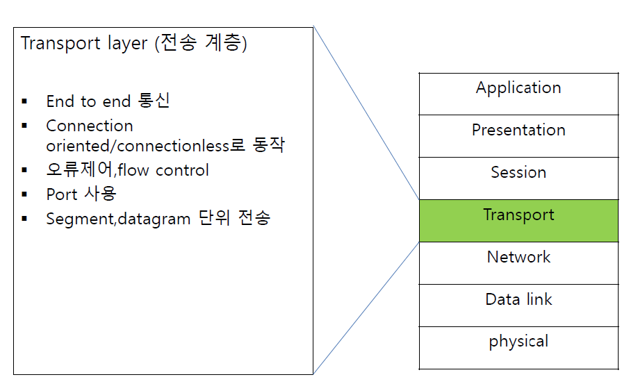
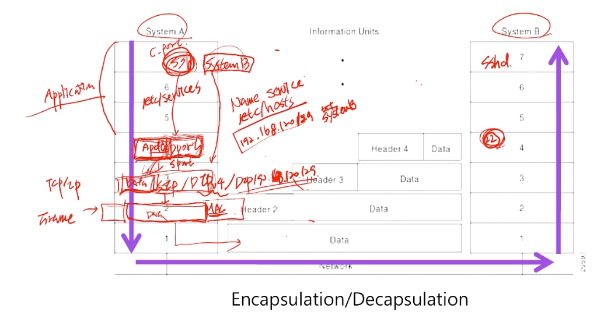
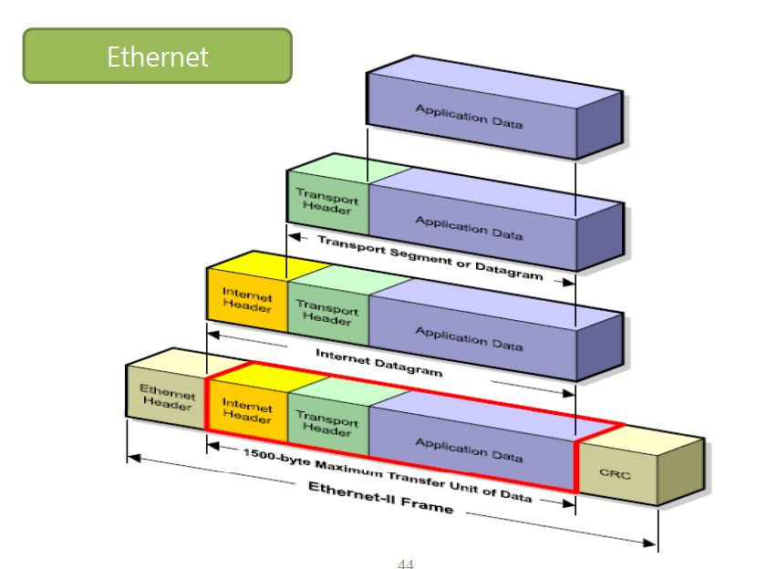
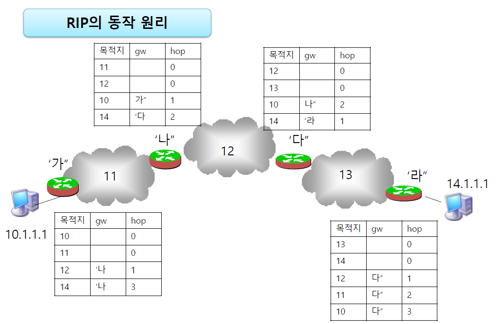

# 2026년 9월 11일 실습 및 네트워크 정리

9.10 기록과 별도로 작성했다. 사용자가 제공한 실행 결과와 학습용 예시를 구분했다. 아래 예시 명령 전체를 실제 실행한 것은 아니다.

## 1. 환경

- Rocky10: 명령 실행 및 NFS 서버. `s1`은 실습에서 Rocky를 가리키는 이름으로 사용.
- Ubuntu: `u1`, IPv4 `192.168.120.129/24`, 인터페이스 `ens160`.
- Ubuntu MAC: `00:0c:29:25:c6:5a`.
- Ubuntu IPv6 링크 로컬: `fe80::20c:29ff:fe25:c65a/64`.
- root와 student는 홈 디렉터리 및 SSH 신원 기록이 서로 다르다.

## 2. SCP와 SFTP

SCP는 SSH를 통해 파일을 복사하는 명령이고, SFTP는 SSH를 통해 파일 전송·목록 조회·디렉터리 이동 등을 수행하는 프로토콜이다. 현대 OpenSSH의 scp 명령은 기본 전송에 SFTP를 사용할 수 있으므로 명령 이름과 내부 프로토콜은 구분한다.

학습용 예시:

```bash
scp test.txt student@u1:/home/student/
scp student@u1:/home/student/test.txt .
scp -r myfolder student@u1:/home/student/
scp -P 220 test.txt student@u1:/home/student/
sftp -P 220 student@u1
ssh -p 220 student@u1
```

- `.`: 로컬 현재 폴더.
- SCP `-r`: 폴더 재귀 복사, `-i`: 개인 키 파일 지정.
- 포트 지정: SSH는 `-p`, SCP와 SFTP는 `-P`.

### 실제 SFTP 실습

```text
root@rocky10:~# sftp student@192.
ssh: Could not resolve hostname 192.: Name or service not known
root@rocky10:~# sftp student@u1
Connected to u1.
sftp> pwd
Remote working directory: /home/student
sftp> ls
sftp> lpwd
Local working directory: /root
sftp> lls
'!' anaconda-ks.cfg d1 f1 fstab lab
sftp> put anaconda-ks.cfg
Uploading anaconda-ks.cfg to /home/student/anaconda-ks.cfg
anaconda-ks.cfg 100% 1510
sftp> ls
anaconda-ks.cfg
sftp> exit
```

`192.`은 불완전한 IP이고 이름으로도 해석되지 않았다. `u1` 접속과 업로드는 성공했다.

| SFTP 명령 | 의미 |
|---|---|
| `pwd`, `ls`, `dir`, `cd` | 원격 경로·목록 확인 및 이동 |
| `lpwd`, `lls`, `lcd` | 로컬 경로·목록 확인 및 이동 |
| `put 파일` | 로컬 → 원격 업로드 |
| `get 파일` | 원격 → 로컬 다운로드 |

전송 경로: Rocky `/root/anaconda-ks.cfg` → Ubuntu `/home/student/anaconda-ks.cfg`. 이 문서에는 해당 파일의 실제 내용은 포함하지 않았다.

## 3. SSH 오류와 계정별 known_hosts

### REMOTE HOST IDENTIFICATION HAS CHANGED

student에서 `ssh student@u1` 실행 시 `/home/student/.ssh/known_hosts:10`에 저장된 키와 서버가 제시한 키가 달라 접속이 차단됐다. 비밀번호 오류가 아니라 서버 신원 확인 오류다.

- 로컬 root는 `/root/.ssh/known_hosts`를 사용한다.
- 로컬 student는 `/home/student/.ssh/known_hosts`를 사용한다.
- `ssh student@u1`의 student는 원격 로그인 계정이다. 신원 기록은 명령을 실행한 로컬 계정을 기준으로 읽는다.
- root에서 접속 가능하다는 사실만으로 키 변경의 정당성이 검증되는 것은 아니다.

서버 재생성·키 변경이 맞는지 또는 실제 서버 지문을 확인한 뒤, 해당 로컬 계정에서 갱신하는 방법:

```bash
ssh-keygen -R u1
ssh student@u1
```

### No route to host

```text
ssh: connect to host u1 port 22: No route to host
```

네트워크 경로, 서버 전원, 방화벽 등을 점검해야 하는 연결 오류다. 이번 SSH 사례에서는 사용자가 Ubuntu VM이 꺼져 있었음을 확인했다.

진단용 명령:

```bash
# Rocky
getent hosts u1
ping -c 3 u1
# Ubuntu 콘솔
ip -br addr
systemctl status ssh
```

전날 220번 포트 설정에 관한 대화가 있었지만, 이날 뒤의 IPv6 SSH 접속은 `-p` 없이 성공하여 해당 주소의 TCP 22 응답이 확인됐다. 모든 주소가 220번만 사용한다고 단정하지 않는다.

## 4. NFS 서버와 클라이언트 실습

NFS는 원격 폴더를 로컬 경로에 마운트해서 사용하는 방식이다. SFTP 업로드와 달리 마운트한 경로에서 파일을 만들면 서버 파일 시스템에 반영된다.

### Rocky 서버 설정: 실제 기록

```bash
dnf install -y nfs-utils
vi /etc/exports
mkdir -m 1777 /share
systemctl enable --now nfs-server
exportfs
```

`nfs-utils`는 이미 설치되어 있었다. `/etc/exports`에 입력한 내용:

```text
/share -sync,rw u1
```

이 줄에서 `-sync,rw`는 뒤따르는 클라이언트에 적용할 기본 옵션이다. 클라이언트가 하나인 이 예시는 다음과 같은 의미다.

```text
/share u1(sync,rw)
```

- `/share`: 공유할 서버 폴더.
- `u1`: 접근을 허용할 클라이언트 호스트. 사용자 계정 이름이 아니다.
- `rw`: 읽기·쓰기 허용. 실제 파일 권한도 적용된다.
- `sync`: 변경을 안정적인 저장소에 기록한 뒤 응답.
- `systemctl enable --now`: 부팅 시 자동 시작 설정과 즉시 시작.

확인 출력:

```text
/share    ubuntu
```

설정의 u1과 표시된 ubuntu는 같은 호스트의 이름 해석 결과일 가능성이 있다. 이 출력만으로 별칭 관계를 확정하지 않고 `getent hosts u1`, `getent hosts ubuntu`로 비교할 수 있다.

### 1777 권한

`mkdir -m 1777 /share`는 폴더 생성과 동시에 권한을 지정한다.

- 뒤의 `777`: 소유자·그룹·기타 사용자 모두 읽기·쓰기·디렉터리 탐색 허용.
- 앞의 `1`: 스티키 비트. 공용 디렉터리에서 파일 삭제·이름 변경을 파일 소유자, 디렉터리 소유자, 특권 사용자 등으로 제한한다.
- 스티키 비트는 파일 내용 수정 자체를 막지 않는다. 내용 수정은 파일 권한에 따른다.

### 설정 적용·조회 및 매뉴얼 예시

```bash
exportfs -ra
exportfs -v
man exports
```

`-r`은 공유 설정 재반영, `-a`는 전체 항목 대상, `-v`는 상세 확인이다. 강의의 `/share *(rw)`는 모든 클라이언트를 대상으로 허용하는 예시이며, 실제 입력한 u1 제한 설정과 구분한다.

| exports 옵션 | 의미 |
|---|---|
| `ro` / `rw` | 읽기 전용 / 읽기·쓰기 |
| `no_root_squash` | 클라이언트 root 요청의 root 권한 유지 |
| `all_squash` | 모든 사용자 요청을 익명 사용자로 매핑 |
| `anonuid`, `anongid` | 익명 사용자 UID·GID 지정 |
| `insecure` | 1024 이상인 클라이언트 출발지 포트도 허용. 암호화 옵션이 아님 |

### Ubuntu 마운트와 방화벽 오류

사용자가 `apt install -u nfs-server` 실행 일부를 제공했지만 설치 완료는 확인되지 않았다. NFS 클라이언트에 필요한 일반적인 패키지는 `nfs-common`이다.

```text
root@ubuntu:~# mount s1:/ /mnt
mount.nfs: No route to host for s1:/ on /mnt
```

Rocky에서 NFS 방화벽 허용 후 재시도:

```bash
firewall-cmd --add-service nfs --permanent
firewall-cmd --reload
```

두 명령 모두 `success`. zone을 생략하면 기본 zone에 적용되므로 실제 연결 인터페이스의 zone을 확인해야 한다. 이후 마운트가 성공했다. 이 허용은 해당 실습에 충분했지만 NFS 버전·구성에 따라 추가 서비스 요구가 달라질 수 있다.

### 실제 파일 생성 및 busy 오류

```text
root@ubuntu:~# mount s1:/ /mnt
root@ubuntu:~# ls /mnt
share
root@ubuntu:~# cd share
-bash: cd: share: No such file or directory
root@ubuntu:~# cd /mnt
root@ubuntu:/mnt# cd share
root@ubuntu:/mnt/share# touch hello
root@ubuntu:/mnt/share# umount /mnt
umount.nfs4: /mnt: device is busy
```

- `ls /mnt`는 목록만 출력하고 현재 디렉터리를 바꾸지 않는다. 따라서 `/root`에서 `cd share`를 하면 `/root/share`를 찾는다.
- 현재 셸이 `/mnt/share`를 사용하므로 마운트 해제가 실패했다.

해결과 최종 확인:

```bash
cd /root
umount /mnt
mount s1:/share /mnt
ls /mnt
```

사용자가 최종 제공한 출력은 `hello`였다. 중간 예시에 `f1 hello`가 있었지만 최종 확인은 `hello`로 기록한다.

| 마운트 | 이번 환경에서 접근한 경로 |
|---|---|
| `s1:/` → `/mnt` | `/mnt/share` |
| `s1:/share` → `/mnt` | `/mnt` |

`s1:/`도 실제 성공했으므로 무조건 잘못된 경로라고 보지 않는다. NFSv4 서버의 제공 계층에 따라 보이는 경로가 달라질 수 있다. 마운트 해제는 서버 파일 삭제가 아니므로 hello가 남는다.

## 5. IPv6 링크 로컬 ping과 SSH

Ubuntu `ip a`에서 확인:

```text
ens160: UP, LOWER_UP, mtu 1500
link/ether 00:0c:29:25:c6:5a
inet 192.168.120.129/24
inet6 fe80::20c:29ff:fe25:c65a/64 scope link
```

Rocky에서 인터페이스 지정 없이 실행한 ping6는 scope 지정 경고와 함께 60개 전송, 0개 수신이었다.

```bash
ping6 fe80::20c:29ff:fe25:c65a%ens160
```

인터페이스 지정 후 **4개 전송, 4개 수신, 손실 0%**. 평균 RTT는 약 12.272ms였다.

- `fe80::` 링크 로컬 주소는 같은 링크에서 사용하며 라우터를 넘어 전달되지 않는다.
- `%ens160`은 출발지 Rocky의 인터페이스를 지정한다.
- 대체 문법: `ping -6 -I ens160 fe80::20c:29ff:fe25:c65a`.

```bash
ssh student@fe80::20c:29ff:fe25:c65a%ens160
```

기존 `192.168.120.129`, `u1`에 저장된 것과 같은 서버 키라는 안내가 나왔다. 사용자가 `yes`를 입력한 뒤 IPv6 주소가 known_hosts에 추가되고 Ubuntu 24.04.3 LTS 로그인 배너가 출력됐다. 새 주소의 최초 등록 안내이며, 키 불일치 오류와는 다르다. IPv4·IPv6·u1이 같은 Ubuntu를 가리키므로 Ubuntu로 로그인되는 것이 정상이다.

## 6. 기타 학습: 종료, Podman, grep

### VM 저장 공간 오류

`Failed to suspend ... Insufficient disk space` 및 `.vmss` 저장 실패는 Windows C드라이브에서 가상 머신 실행 상태 저장 공간이 부족한 상황이었다. 추가 요구량은 1011.7MB. RAM 부족 메시지가 아니다.

일시 중단 대신 게스트 OS를 정상 종료하려면 root에서 `poweroff`, 일반 사용자에서 `sudo poweroff`. 가상 디스크 파일을 임의 삭제하지 않는다.

### Podman — 개념 및 예시, 실행 결과 미제공

컨테이너 생성·실행·관리를 위한 도구. 이미지는 실행 환경의 틀이고 컨테이너는 그 이미지로 만든 실행 환경이다. VM과 달리 컨테이너는 호스트 커널을 공유한다. 일반 사용자 실행도 가능하며 root와 student의 컨테이너 저장소·목록은 기본적으로 분리된다.

```bash
dnf install -y podman
podman run -d --name web -p 8080:80 docker.io/library/nginx
curl http://localhost:8080
podman images
podman ps -a
podman logs web
podman stop web
podman start web
podman rm web
```

`-d`: 백그라운드, `--name`: 이름, `-p 8080:80`: 호스트 8080 → 컨테이너 80. 외부 접근에는 호스트 방화벽 등도 확인한다.

### grep — 검색 예시

```bash
systemctl list-units --type=service --all | grep -E 'ssh|http'
ps -ef | grep -E 'ssh|http'
```

`-E`는 확장 정규식, 따옴표 안의 `|`는 OR. 실제로 찾으려던 원래 명령은 확정되지 않아 서비스·프로세스 예시로 정리했다.

## 7. OSI, End-to-End, 포트

| 계층 | 핵심 역할 | 주소·단위 |
|---|---|---|
| 애플리케이션 | SSH 등 애플리케이션 통신 | 데이터 |
| 4 전송 | 양 끝 애플리케이션 간 통신 | 포트, TCP 세그먼트·UDP 데이터그램 |
| 3 네트워크 | 호스트 간 전달과 라우팅 | IP, 패킷 |
| 2 데이터 링크 | 같은 링크의 다음 장비로 전달 | MAC, 프레임 |
| 1 물리 | 신호 전송 | 비트열 |

End-to-End는 중간 라우터를 건너뛴다는 뜻이 아니다. 전송 계층의 통신 종단이 양 끝 호스트이며 TCP 확인·재전송·흐름 제어를 종단에서 수행한다는 의미다. UDP에는 TCP와 같은 재전송·흐름 제어가 없다.

포트는 어느 애플리케이션/서비스에 전달할지 구분한다. TCP/UDP 구분과 포트 구분은 별개다. 예: TCP 22는 일반적인 SSH, TCP 80은 일반적인 HTTP. 포트를 바꿀 수 있으므로 번호만으로 실제 애플리케이션을 확정하지 않는다.

```bash
firewall-cmd --add-port=22/tcp --permanent
firewall-cmd --reload
```

위 예시는 TCP 22 허용이며 UDP 22 허용은 아니다. `--add-service=ssh`는 미리 정의된 서비스 규칙을 사용한다.

## 8. SSH로 이해하는 캡슐화·역캡슐화

1. `ssh student@u1`: 이름 해석 설정에 따라 hosts/DNS 등으로 u1의 IP를 구한다. 예: `/etc/hosts`의 `192.168.120.129 u1`.
2. TCP 연결을 준비한다. 출발지는 임시 포트, 목적지는 기본 TCP 22.
3. IP 헤더에 출발지와 최종 목적지 IP를 넣는다. 라우팅 테이블로 다음 홉을 결정한다.
4. IPv4 이더넷에서 다음 홉 MAC을 모르면 ARP로 구한다. 같은 네트워크면 상대, 다른 네트워크면 게이트웨이 MAC이다.
5. ARP 요청은 브로드캐스트, 실제 SSH 프레임은 일반적으로 유니캐스트다.
6. 수신 측은 이더넷 → IP → TCP를 처리하고 소켓을 통해 sshd에 전달한다.
7. TCP 연결 후 SSH 키 교환·서버 신원 확인과 암호화 채널 수립을 거쳐 사용자 인증을 진행한다. 비밀번호도 암호화 채널로 전송된다.

라우터는 매번 3계층 처리를 수행한다. 일반 라우팅에서 출발지·목적지 IP는 유지되지만 TTL은 감소한다. NAT가 있으면 주소 변경이 가능하다. 각 이더넷 구간의 프레임은 새로 만들어지며 MAC 주소가 바뀐다. 일반 스위치를 지날 때마다 MAC을 바꾸는 것은 아니다.

## 9. 이더넷, IP 데이터그램, PDU

이더넷은 유선 LAN의 물리·데이터 링크 기술이다. Ethernet II 프레임은 IP 패킷을 감싼다.

```text
[애플리케이션 데이터]
[TCP/UDP 헤더 | 애플리케이션 데이터]                  4계층 PDU
[IP 헤더 | TCP/UDP 헤더 | 애플리케이션 데이터]        3계층 PDU
[이더넷 헤더 | IP 패킷 | FCS]                        2계층 PDU
```

- PDU(Protocol Data Unit): 각 계층의 통신 데이터 단위라는 이름. 별도의 동작 기능이 아니다.
- TCP: 세그먼트. UDP: UDP 데이터그램.
- IP 데이터그램은 보통 IP 패킷이라고 부른다. 데이터그램이라는 말은 IP·UDP 모두에서 사용된다.
- 상위 계층 PDU 전체가 하위 계층의 데이터 영역에 들어간다.
- 이더넷 헤더: 목적지 MAC, 출발지 MAC, EtherType.
- FCS: CRC 계산 결과를 담는 오류 검출 필드. 오류를 직접 수정하지 않는다.

일반적인 VLAN 태그 없는 Ethernet II 기준:

```text
헤더 14바이트 + 데이터 최대 1500바이트 + FCS 4바이트 = 최대 1518바이트
```

여기에는 프리앰블 등 물리 전송 오버헤드를 포함하지 않는다. MTU 1500은 IP 헤더를 포함한 이더넷 데이터 영역이며, 애플리케이션 데이터만 1500이라는 뜻이 아니다. 옵션 없는 IPv4 20 + TCP 20을 제외하면 TCP 데이터는 1460바이트이고, SSH 자체 오버헤드도 그 안에 포함된다.

## 10. RIP 그림: 목적지, gw, hop

```text
A 10.1.1.1 — 10망 — 가 — 11망 — 나 — 12망 — 다 — 13망 — 라 — 14망 — B 14.1.1.1
```

10~14는 네트워크를 줄여 표시한 것이다. 수업에서 마스크를 255.0.0.0으로 정했다면 각각 `10.0.0.0/8` 등이다. 이미지 자체에는 마스크가 없다.

- 목적지: 도달할 네트워크.
- gw: 바로 다음에 전달할 라우터. 실제 값은 해당 연결 구간의 다음 홉 인터페이스 IP.
- hop: 거리 지표. 강의 그림은 직접 연결을 0으로 표현했다.

| 라우터 | 직접 연결 | 10망 방향(그림 기준) | 14망 방향(그림 기준) |
|---|---|---|---|
| 가 | 10, 11 | 직접, 0 | 나, 3 |
| 나 | 11, 12 | 가, 1 | 다, 2 |
| 다 | 12, 13 | 나, 2 | 라, 1 |
| 라 | 13, 14 | 다, 3 | 직접, 0 |

이웃이 도달 가능한 네트워크와 거리를 광고하면 이를 학습한다. 그림의 10망 정보는 가(0) → 나(1) → 다(2) → 라(3)로 퍼진다. 실제 RIP 메시지 메트릭은 1~16이고 16은 도달 불가이므로 그림의 직접 연결 0 표기와 구분한다. RIP는 같은 목적지의 후보 RIP 경로에서 작은 메트릭을 선호한다.

RIPv2는 일반적으로 `224.0.0.9`, UDP 520으로 이웃에게 경로를 광고한다. SSH 데이터 자체를 이 멀티캐스트 주소로 보내는 것은 아니다.

A에서 B로 보낼 때 `/etc/hosts`는 이름 B를 14.1.1.1로 해석할 수 있지만 RIP가 hosts 파일을 갱신하는 것은 아니다. A는 다른 네트워크로 보내기 위해 기본 게이트웨이 가를 사용한다. 각 라우터가 14망 경로를 조회하여 나 → 다 → 라 → B로 전달한다. A부터 B까지 라우터는 총 4대이며 가의 표에 있는 3과 기준이 다르다.

기본 게이트웨이는 더 구체적인 경로가 없을 때 사용하는 다음 홉이다. A는 가의 10망 쪽 IP, B는 라의 14망 쪽 IP를 사용한다. 구체적인 인터페이스 IP는 그림에 없으므로 추정하지 않는다.

## 11. 양방향 경로와 AWS VPC Peering

요청 A → B의 목적지는 B이고, 응답 B → A의 목적지는 A다. 응답도 목적지 IP에 따라 별도로 라우팅된다. 수신 자체에 역방향 경로가 필요하다는 뜻이 아니라, 응답을 보내기 위해 돌아가는 경로가 필요하다는 뜻이다.

RIP 그림에서는 요청에 14망 경로, 응답에 10망 경로를 사용한다. 일반적으로 왕복 경로가 반드시 동일할 필요는 없지만 양방향 도달성은 필요하다.

### Peering 학습용 예시

- VPC A: `10.0.0.0/16`, EC2 A: `10.0.1.10`.
- VPC B: `10.1.0.0/16`, EC2 B: `10.1.1.20`.
- 두 VPC의 Peering 연결: 예시 ID `pcx-ab`.

| 적용할 서브넷 라우팅 테이블 | 목적지 | 대상 |
|---|---|---|
| EC2 A 서브넷 | 10.0.0.0/16 | local |
| EC2 A 서브넷 | 10.1.0.0/16 | pcx-ab |
| EC2 B 서브넷 | 10.1.0.0/16 | local |
| EC2 B 서브넷 | 10.0.0.0/16 | pcx-ab |

Peering을 수락해 활성화해도 경로를 별도로 설정해야 한다. VPC 내 아무 테이블이 아니라 실제 통신하는 서브넷에 연결된 테이블을 수정한다. EC2 OS의 기본 게이트웨이를 상대 EC2로 바꾸는 방식이 아니다.

요청은 A의 B CIDR 경로로 Peering에 전달되고, 응답은 B의 A CIDR 경로로 돌아온다. 경로 외에도 보안 그룹·네트워크 ACL·호스트 서비스가 통신을 허용해야 한다.

Peering은 RIP처럼 중간 VPC를 경유시키는 기능이 아니다. A–B, B–C Peering이 있어도 A–C 통신이 자동으로 되지 않는다. 직접 Peering 또는 Transit Gateway 등의 별도 구성이 필요하다.

## 참고 자료와 강의 그림

- [RIP v2 — RFC 2453](https://www.rfc-editor.org/rfc/rfc2453.html)
- [AWS Peering 라우팅 테이블 설정](https://docs.aws.amazon.com/vpc/latest/peering/vpc-peering-routing.html)
- [AWS Peering 동작과 비전이성](https://docs.aws.amazon.com/vpc/latest/peering/vpc-peering-basics.html)
- [AWS Peering 연결 문제 확인](https://repost.aws/knowledge-center/vpc-peering-connectivity)

아래 이미지는 사용자가 제공한 강의 화면이다. NFS 관련 초기 이미지 2장은 임시 경로에 원본이 남아 있지 않아 포함하지 못했으며, 화면의 설정과 설명은 위 본문에 기록했다.








