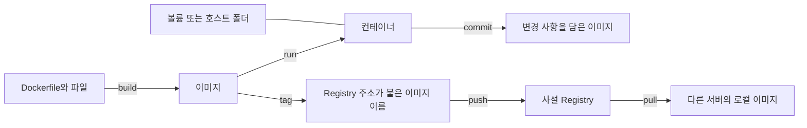
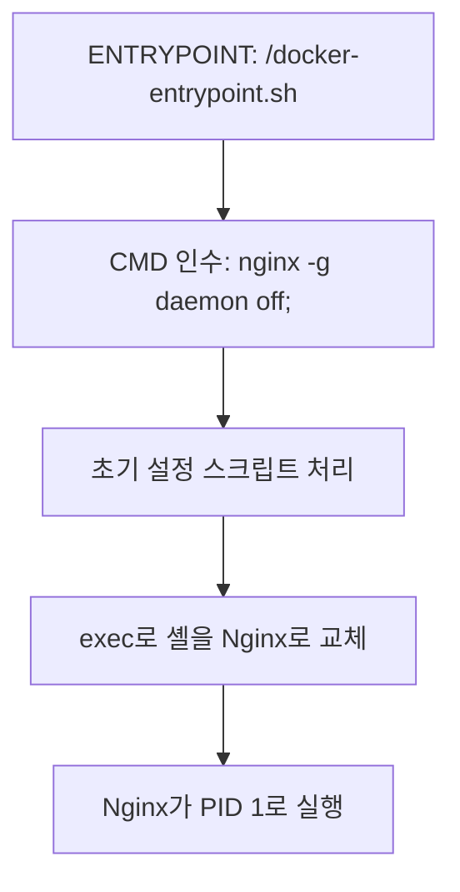
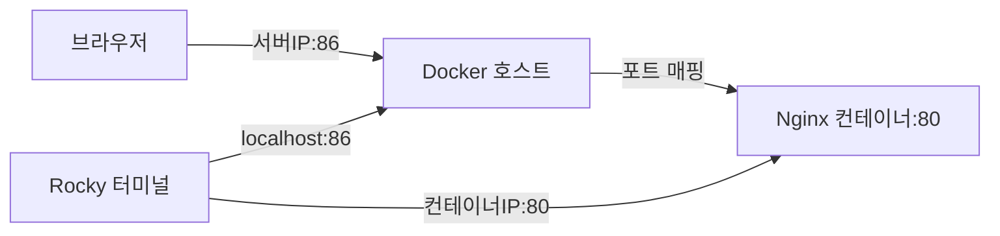
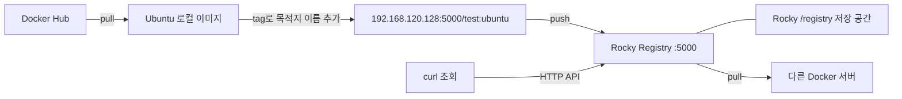

# 9월 16일 Docker 실습 종합 정리

사용자가 제공한 실습 로그와 대화를 바탕으로 정리했다. 아래 명령은 복습용이며, 컨테이너 ID와 IP는 실행 시 다시 확인한다. 앞서 모든 컨테이너를 삭제했으므로 과거 ID는 그대로 재사용할 수 없다.

## 1. 전체 흐름



- Dockerfile: 이미지를 만드는 지시서.
- 이미지: 프로그램, 파일, 설정, 기본 실행 명령을 담은 패키지.
- 컨테이너: 이미지로 생성한 실행 환경. 하나의 이미지로 여러 개 생성 가능.
- Registry: 이미지를 업로드하고 내려받는 서버.

## 2. Dockerfile 지시어

| 지시어 | 역할 | 시점 또는 적용 범위 |
|---|---|---|
| FROM | 기반 이미지 선택 | 빌드 |
| RUN | 명령 실행 및 파일 변경 반영 | 빌드 |
| COPY | 빌드 컨텍스트의 파일을 이미지에 복사 | 빌드 |
| CMD | 기본 명령 또는 ENTRYPOINT의 기본 인수 | 컨테이너 시작 |
| ENTRYPOINT | 시작 프로그램 지정 | 컨테이너 시작 |
| ENV | 환경변수 기본값 | 이후 빌드 단계 및 실행 환경 |
| USER | 실행 사용자 지정 | 이후 RUN 및 기본 실행 사용자 |
| WORKDIR | 작업 디렉터리 지정 | 이후 명령 및 기본 시작 위치 |
| EXPOSE | 사용하는 포트 정보 표시 | 포트를 실제로 게시하지는 않음 |
| VOLUME | 볼륨 연결 경로 선언 | 컨테이너 생성 시 연결 |

```bash
cd /root/docker_class
docker build -t test:nginx nginx/
# nginx 폴더 안에서 실행한다면:
cd nginx
docker build -t test:nginx .
```

`-t`는 이미지 이름:태그를 지정한다. 마지막 경로는 빌드 컨텍스트다. `nginx/` 안에서 다시 `nginx/`를 지정하면 존재하지 않는 하위 폴더를 찾게 된다.

## 3. CMD, ENTRYPOINT, 환경변수

### CMD 실습

```dockerfile
FROM busybox
CMD ["echo", "hello world"]
```

```bash
docker run --rm test:cmd
# hello world
docker run --rm test:cmd echo I love you
# I love you
```

이미지 뒤에 명령을 주면 이번 실행의 CMD를 대체한다. 이미지 원본은 바뀌지 않는다.

### ENTRYPOINT 실습

```dockerfile
FROM busybox
ENTRYPOINT ["echo", "hello world"]
```

```bash
docker run --rm test:entry I love you
# hello world I love you
```

exec 형식 ENTRYPOINT 뒤에 실행 시 전달한 인수가 붙는다. 실행 프로그램과 기본 인수를 나누려면:

```dockerfile
ENTRYPOINT ["echo"]
CMD ["hello world"]
```

### 공식 Nginx 시작 구조



스크립트의 `exec "$@"`는 전달받은 명령으로 현재 프로세스를 교체한다. `$1`은 첫 인수, `"$@"`는 모든 인수다. Docker가 CMD를 인수로 전달하며, 이를 실행하는 것은 해당 스크립트의 동작이다.

### ENV 실습

```dockerfile
FROM busybox
ENV CLASS=Docker
CMD echo hello $CLASS
```

```bash
docker run --rm test:env
# hello Docker
docker run --rm -e CLASS=Container test:env
# hello Container
```

`-e`는 해당 컨테이너의 환경변수를 지정한다. `CMD ["echo", "hello $CLASS"]`는 셸을 거치지 않아 변수를 치환하지 않는다. 셸이 필요하면 `CMD ["sh", "-c", "echo hello $CLASS"]`처럼 명시할 수 있다.

## 4. 실행과 종료, 포트

| 명령/옵션 | 의미 |
|---|---|
| docker run | 새 컨테이너 생성 후 실행 |
| docker start ID | 기존 중지 컨테이너 재시작 |
| docker stop ID | 컨테이너 중지 |
| docker exec ID 명령 | 실행 중인 컨테이너에서 추가 명령 실행 |
| -d | 터미널에서 분리하여 실행 |
| -it | 입력 유지와 가상 터미널 할당; 셸을 자동 선택하지 않음 |
| --rm | 종료 후 컨테이너와 연결된 익명 볼륨 자동 삭제 |
| -p 86:80 | 호스트 86 → 컨테이너 80 연결 |

`nginx -g "daemon off;"`는 Nginx 자체가 포어그라운드에 머물도록 한다. Docker의 `-d`와 함께 사용할 수 있다. 컨테이너는 주 프로세스가 끝나면 종료된다.

`CMD nginx -g "daemon off;"`는 셸을 거친다. `CMD ["nginx", "-g", "daemon off;"]`는 직접 실행하므로 신호 전달 구조가 단순해진다. 기존 ENTRYPOINT가 있다면 함께 검토한다.



- localhost는 명령을 실행하는 자기 자신이다. Rocky에서 localhost는 Rocky이고, 컨테이너 IP와 다르다.
- `172.17.0.6`은 당시 컨테이너 IP였다. 재생성 시 바뀔 수 있다.
- Rocky의 Registry 주소는 실습 후반 `192.168.120.128:5000`으로 확인됐다.
- 웹 브라우저에서는 `192.168.120.129:86`의 페이지 표시가 확인됐다. 두 서버 주소를 혼용하지 않는다.

## 5. USER와 WORKDIR

```dockerfile
FROM ubuntu
RUN mkdir -m 1777 /share
RUN touch /share/hello.txt
RUN useradd student
USER student
WORKDIR /share
RUN touch student.txt
CMD ["ls", "-l", "/share"]
```

- hello.txt는 root, student.txt는 student 소유로 생성된다.
- `1777`은 모두에게 디렉터리 접근·쓰기 권한을 주고 sticky bit로 타인 파일의 삭제·이름 변경을 제한한다. 내용 수정 여부는 파일 권한을 따른다.
- `docker run --rm -it test:user /bin/bash`는 기본 CMD를 Bash로 바꾸며, student 사용자로 /share에서 시작한다.

## 6. 저장 공간 네 가지

| 방식 | 예시 | 수명과 용도 |
|---|---|---|
| 바인드 마운트 | -v /share:/app | 지정한 호스트 폴더 공유 |
| 이름 있는 볼륨 | -v db1:/var/lib/mysql | 이름으로 재사용; docker volume create db1 |
| 익명 볼륨 | -v /app 또는 VOLUME /app | 임의 이름 생성; 새 run이 이전 볼륨을 자동 재사용하지 않음 |
| tmpfs | --mount type=tmpfs,destination=/var/tmp | 메모리 기반 임시 저장; 컨테이너 중지 시 소멸 |

`--tmpfs /var/tmp`도 tmpfs를 연결하는 문법이다. VOLUME 선언과 마운트 옵션이 모두 없다면 파일은 보통 컨테이너 쓰기 영역에 저장된다.

익명 볼륨 실습:

```dockerfile
FROM ubuntu
VOLUME /app
CMD touch /app/hello.txt; ls -l /app
```

`docker run test:vol` 후 호스트 `/var/lib/docker/volumes/무작위이름/_data/hello.txt`가 생성됐다. 일반 `docker rm`으로 컨테이너를 지운 뒤에도 남았다. `docker rm -v` 또는 실행 시 `--rm`은 연결된 익명 볼륨 삭제에 영향을 주지만 이름 있는 볼륨을 같은 방식으로 자동 삭제하지 않는다.

## 7. NFS 공유와 웹페이지 변경


Ubuntu에서:

```bash
sudo mkdir -p /share
sudo mount -t nfs s1:/share /share
df -h /share
docker run -d -v /share:/usr/share/nginx/html -p 86:80 test:html
```

공유 서버에서 파일 수정:

```bash
echo 'This is a nfs-vol test..update2' > /share/index.html
```

위 명령은 기존 index.html을 덮어쓴다. 파일명은 `index_html`이 아닌 `index.html`이다. 브라우저에서 새 문구가 표시된 것을 확인했다. 바인드 마운트 데이터 변경은 이미지 재빌드나 컨테이너 재시작 없이 반영된다.

NFS는 파일 공유이고 웹서비스는 Nginx가 담당한다. NFS 마운트만으로 해당 서버의 웹 포트가 생기지 않는다. 빈 호스트 폴더를 마운트하면 이미지에 원래 있던 페이지가 가려진다.

## 8. 이미지 파일 전송과 commit

```bash
# 원본 서버
docker save test:html > /tmp/test-html.tar
scp /tmp/test-html.tar student@u1:/tmp
# 수신 서버에서 이미지 가져오기
docker load -i /tmp/test-html.tar
```

save와 scp 성공은 로그에서 확인됐고, load는 수신 후 필요한 절차로 정리했다. 이미지 파일에는 바인드 마운트의 /share 데이터가 포함되지 않는다.

```bash
docker commit -a "student" -m "add ip" 컨테이너ID test:ip
```

- -a: 작성자. -m: 메모. `add ip`라는 메모가 패키지를 설치하는 것은 아니다.
- 컨테이너의 파일 변경을 이미지로 저장하며 마운트 데이터는 제외한다.
- 같은 태그로 다시 commit하면 그 태그가 새 이미지로 이동한다.
- db0, a60 커밋은 성공했다. 1ac는 원본 이미지 content digest 누락 오류로 실패했다. 정확한 누락 원인은 확정되지 않았다.

## 9. 관찰 명령

| 명령 | 확인 대상 |
|---|---|
| docker ps / docker ps -a | 실행 중 / 전체 컨테이너 |
| docker images | 로컬 이미지; U는 컨테이너가 사용하는 이미지 |
| docker history 이미지 | 이미지 구성 이력 |
| docker inspect ID | 설정, 네트워크, 마운트 정보 |
| docker logs ID | 표준 출력·표준 오류 로그 |
| docker top ID | 프로세스 |
| docker stats --no-stream | CPU, 메모리, I/O 사용량 한 번 출력 |
| docker events | 실시간 이벤트 |
| docker system df | Docker 디스크 사용량 |

`docker logs`가 비어도 프로세스는 실행 중일 수 있다. 직접 설치한 Nginx는 /var/log/nginx에 파일 로그를 남길 수 있다.

stats의 메모리 LIMIT은 미리 확보한 용량이 아니며, NET I/O와 BLOCK I/O는 누적량이다. PIDS는 프로세스·스레드 수다.

events에서 관찰한 흐름:

```text
attach → network connect → start → network disconnect → die → destroy
```

`die`는 종료, `destroy`는 삭제다. exitCode=0은 정상 종료다.

## 10. 삭제 명령 구분

| 명령 | 대상 |
|---|---|
| docker rm ID | 중지된 컨테이너 |
| docker rm -f ID | 실행 중이어도 강제 삭제 |
| docker system prune | 중지 컨테이너, 미사용 네트워크, dangling 이미지, 미사용 빌드 캐시 |
| docker system prune -a | 이미지 정리 범위를 컨테이너가 참조하지 않는 이미지까지 확대 |
| docker volume prune | 이번 버전에서 미사용 익명 로컬 볼륨 |

실습에서 일반 system prune은 실행했고, system prune -a 및 volume prune은 N으로 취소했다. 공유 레이어가 남아 삭제 개수에 비해 회수 용량이 작았다.

`docker rm -f $(docker ps -aq)`는 모든 컨테이너를 강제로 삭제한다. 실제로 기존 6개를 삭제했고 이후 Registry를 다시 생성했다. 일반 따옴표는 명령 치환을 하지 않는다. 빈 목록이면 rm 인수가 없어 오류가 난다.

별칭은 `alias drmall='docker rm $(docker ps -aq)'` 형식으로 정의할 수 있지만, 빈 목록 오류와 실행 중 컨테이너 삭제 불가라는 제한이 있다. .bashrc에 저장할 때 echo의 큰따옴표 안에 명령 치환을 넣으면 저장 시점에 실행되므로 주의한다.

## 11. 사설 Registry 구조와 전체 절차



### 1단계: Rocky에서 Registry 준비

```bash
docker run -d -v /registry:/var/lib/registry -p 5000:5000 \
  --name registry-server --restart=always registry
```

이미 같은 이름의 컨테이너가 있다면 새로 생성하지 않는다. -d는 분리 실행, -v는 저장 폴더 연결, -p는 포트 게시, --name은 이름, --restart는 재시작 정책이다.

### 2단계: Ubuntu Docker에 HTTP Registry 허용

`sudo vi /etc/docker/daemon.json`으로 편집한다. 기존 설정이 있으면 유지하며 항목을 합친다.

```json
{
  "insecure-registries": ["192.168.120.128:5000"]
}
```

```bash
sudo systemctl restart docker
```

HTTP를 사용하는 실습 환경의 설정이다. daemon.json만 변경한 경우 daemon-reload는 필요하지 않다. Docker 재시작은 실행 중 컨테이너에 영향을 줄 수 있다. `restrat`가 아닌 `restart`다. 이 설정은 push하는 클라이언트 서버에 적용한다.

### 3단계: 이미지 준비 → 이름 추가 → 업로드 → 조회

```bash
docker pull ubuntu:latest
docker tag ubuntu:latest 192.168.120.128:5000/test:ubuntu
docker push 192.168.120.128:5000/test:ubuntu
curl http://192.168.120.128:5000/v2/_catalog
curl http://192.168.120.128:5000/v2/test/tags/list
```

| 단계 | 언제 사용하는가 | 의미 |
|---|---|---|
| pull | 로컬에 이미지가 없을 때 | 내려받기 |
| tag | push하기 전 | 로컬 이미지에 Registry 목적지 이름 추가 |
| push | 정확한 목적지 태그가 준비된 후 | 실제 업로드 |
| curl | 연결 확인 또는 업로드 후 목록 확인 | HTTP API 조회 |

이름 구조:

```text
192.168.120.128:5000 / test : ubuntu
Registry 주소          저장소   태그
```

`s1:5000/test:ubuntu`와 IP 기반 이름은 같은 서버를 가리켜도 Docker 이미지 이름으로는 다르다. tag와 push에 동일한 문자열을 사용한다.

`latest`는 태그를 생략할 때 사용하는 기본 태그 이름이다. 최신 버전을 자동 검색하거나 이미지를 자동 갱신하는 기능은 아니다.

GET은 대소문자를 구분하는 HTTP 메서드다. 일반 curl 조회는 기본 GET이므로 -X GET을 생략할 수 있다. `_catalog`는 저장소 목록, `/test/tags/list`는 test의 태그 목록이다.

### 확인된 업로드 결과

- Rocky에서 `localhost:5000/test:alpine`, `localhost:5000/test:cmd` push 성공.
- Ubuntu에서 `192.168.120.128:5000/test:ubuntu` push 성공.
- Alpine의 단일 플랫폼 업로드 안내는 실패가 아니었음.
- localhost는 접속한 서버 자신이므로 Ubuntu에서 Rocky Registry를 가리킬 때는 Rocky IP 또는 s1을 사용함.

## 12. 오늘의 오류 복습

| 메시지 또는 현상 | 원인 및 대응 |
|---|---|
| path nginx/ not found | 현재 폴더 기준 경로 확인; 해당 폴더 안에서는 `.` |
| vi E212 | 이번 실습에서는 부모 html 디렉터리 생성 후 저장 |
| ls-l: not found | `ls -l`로 명령과 옵션 사이 공백 |
| No such image | 해당 서버에서 pull 또는 build |
| tag does not exist | push와 동일한 이름으로 먼저 tag |
| HTTP response to HTTPS client | 실습용 HTTP Registry 허용 설정 및 Docker 재시작 |
| no route to host | 서버 상태, 네트워크, 방화벽 등 연결 문제 확인 |
| 404 on _catlog | `/v2/_catalog` 철자 수정 |
| 페이지가 바뀌지 않음 | 이번에는 index_html과 index.html 혼동 |
| No such container | 해당 서버의 docker ps -a에서 실제 ID/이름 확인 |
| soft lockup | 커널 경고; Docker 문법 오류가 아님. 원인은 확정되지 않음 |

## 핵심 기억

1. build는 이미지 생성, run은 새 컨테이너 생성, start는 기존 컨테이너 재시작.
2. CMD는 기본값이며, ENTRYPOINT와 함께 쓰면 기본 인수 역할을 할 수 있음.
3. 호스트 포트와 컨테이너 포트, localhost와 컨테이너 IP를 구분.
4. 컨테이너와 데이터의 수명은 별개; 마운트 데이터는 이미지 push나 commit에 포함되지 않음.
5. tag는 이름 추가, push는 업로드, curl은 조회.
